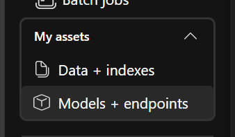
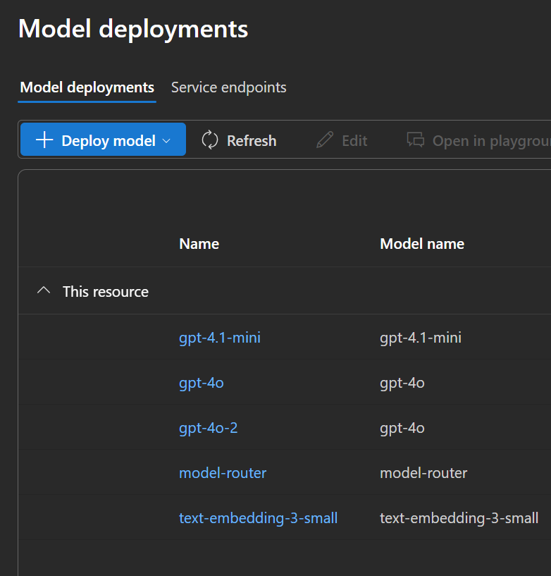

# Agent Framework Workshop Guide

## Introduction

Welcome to the Microsoft Agent Framework workshop! This project is designed to help you learn and practice implementing multi-agent systems using Agent Framework. The repository contains a series of progressive exercises that will guide you through building increasingly complex agent systems, from simple single-agent interactions to sophisticated multi-agent collaborative scenarios and MCP servers.

## Setup

### Prerequisites

- GitHub Codespaces
- (or run locally with [Python](https://www.python.org/) 3.9+ installed, see instructions below if needed)
- An Azure OpenAI API key or OpenAI API key (For production ready deployments, you should refrain from using keys, and switch to [managed identities](https://learn.microsoft.com/entra/identity/managed-identities-azure-resources/overview))
- [Visual Studio Code](https://code.visualstudio.com/)
- [UV package manager](https://docs.astral.sh/uv/getting-started/installation/)


When not using Codespaces, follow below instructions:

### Installation

1. **Launch VS Code**
    ```cmd
    git clone <repo-url>
    cd agent-framework-workshop
    ```

2. **Clone the repository**

3. **Local Dependencies Setup**

The project is managed by pyproject.toml and [uv package manager](https://docs.astral.sh/uv/getting-started/installation/).

For local execution init the .venv environment with uv:

```python
# Use command prompt
uv sync --prerelease=allow
```
This creates a .venv folder in your project directory, installs all dependencies defined in pyproject.toml into that environment and ensures pre-release versions are allowed.

3. **Activate the virtual environment:**

    **Windows:**
   ```cmd
   .venv\Scripts\activate
   ```
*Note*: After this step all project-related commands should run inside the created virtual environment

4. **Copy the environment variables template:**

    ```cmd
    copy .env.example .env
    ```

5. **(Optional) Register Jupyter kernel:**

    ```cmd
    python -m ipykernel install --user --name=agent-framework-workshop
    ```
This adds your virtual environment as a selectable kernel in Jupyter.

### AI Endpoints Setup

1. Navigate to the Azure Portal `https://portal.azure.com/#home`
2. Login using your credentials
3. Open a new tab in your browser and go to `https://ai.azure.com` (you should be logged in already)
4. Create a new project if none are available.
5. Deploy a GPT-4o model. You can follow the numbered steps in the screenshot below:

- Navigate to `models + endpoints`



- Deploy a new model (gpt-4o for this workshop)




6. Get the API endpoint and key from:


7. Copy and paste the deployment name, endpoint and API key into a `.env` file. You can find an example in `.env.example`.


```python
# Azure OpenAI configuration
AZURE_OPENAI_ENDPOINT=https://<resource>.openai.azure.com/
# Note that cognitiveservices endpoints also work: https://<resource>.cognitiveservices.azure.com/
AZURE_OPENAI_API_KEY=<your-api-key>
AZURE_OPENAI_API_VERSION=2025-03-01-preview
AZURE_OPENAI_CHAT_DEPLOYMENT_NAME=gpt-4o-2024-11-20
AZURE_OPENAI_EMBEDDING_DEPLOYMENT_NAME=text-embedding-ada-002
``` 


## Getting Started
Start with the first exercise and progress through them sequentially.

Use documentation on https://learn.microsoft.com/en-us/agent-framework/
to help you with getting up to speed and figuring out what steps to take to complete the exercises.

## Project Structure 

```
agent-framework-workshop/
├── 01-single-agents/    
│   ├── 01.1-single-agents.ipynb      # Agent fundamentals
│   ├── 01.2-sigle-agent-mcp.ipynb    # MAF + MCP example
├── 02-workflows/                     # Agent creation and orchestration
│   ├── 02.1-intro-workflows.ipynb    # Intro to core concepts
│   ├── 02.2-orchestrations.ipynb     # Multi-agent communication
├── mcp/
│   ├── contoso.db   
│   ├── mcp_server.py 
├── exercises/                       
│   └── 03-human-in-the-loop.ipynb    # [TODO] Need to add prereqs - workflow states, request/response patterns
├── devui_samples/               # [IN PROGRESS] Complete runnable scripts with DevUI added
│   ├── 1-chatbot.py             # Simple chatbot workflow (from SK 4.1)
│   ├── 2-content.py             # Content creation workflow (from SK 4.1) 
└── .env.example                 # Environment variables template
```


---


